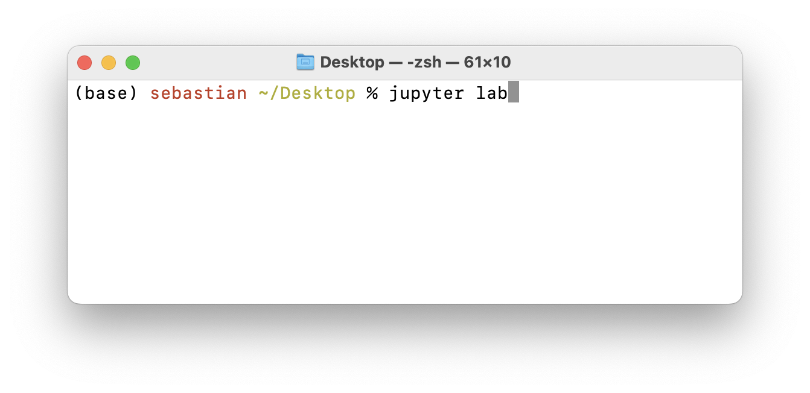
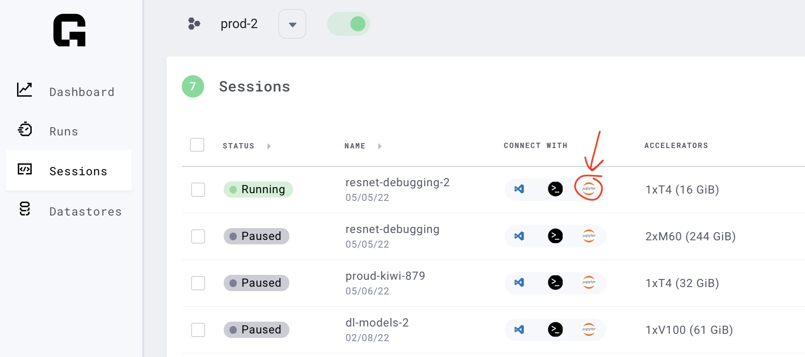
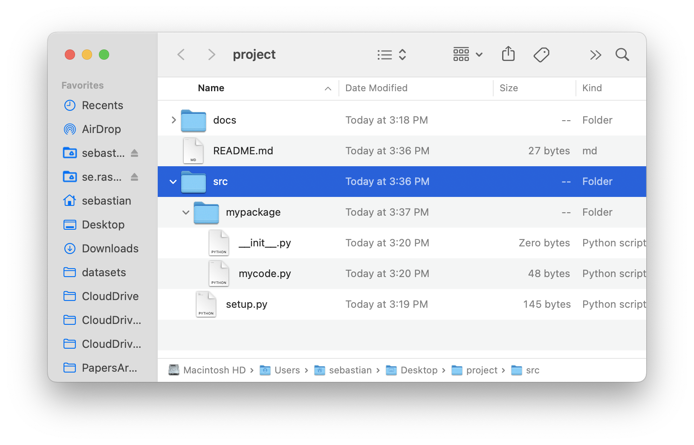
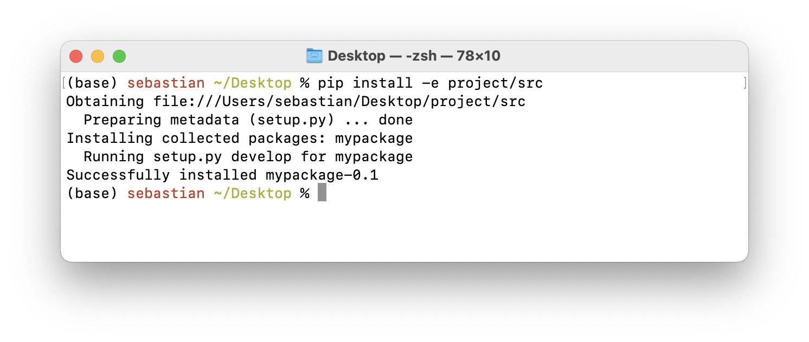
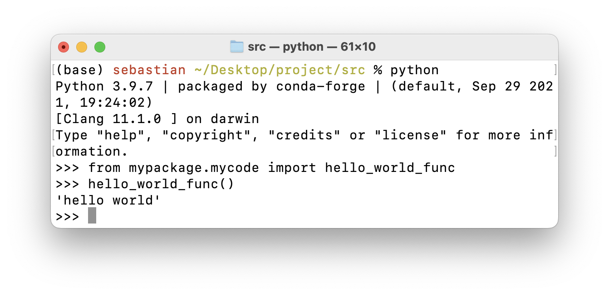

# Episode 1 Show Notes

## 1. Using Jupyter Notebooks

Excited to get started with using Jupyter notebooks? The most common application for working with Jupyter notebooks is JupyterLab. Jupyter notebooks are great scratch pads for brainstorming ideas, and there are two common ways to use them: locally on our computer or in the cloud.

### 1a) On Your Computer

We recommend the official installation instructions for getting it set up: [https://jupyterlab.readthedocs.io/en/stable/getting_started/installation.html](https://jupyterlab.readthedocs.io/en/stable/getting_started/installation.html)

Personally, we prefer installing JupyterLab via conda (more on conda in a future episode) via

```bash
conda install -c conda-forge jupyterlab
```

Once you have it installed, you can type `jupyter lab` in your terminal and press Enter, and JupyterLab should open automatically in your web browser.



### 1b) In the Cloud (Colab, Grid)

If you prefer working in the cloud, Google Colab is an easy and free way for doing so. You can check it out [here](https://colab.research.google.com/).

If you prefer to select your own hardware, we recommend using the [Grid.ai](https://www.grid.ai/) platform where you can open JupyterLab directoy from the web browser after you created a session:




## 2. Setting Up a Basic Python Project

We will revist this topic in a future episode! However, if you are curious and can't wait, here is how this works!

A basic Python project can start with a simple folder structure. Of course, the exact structure depends on the use-case context, but most often we start with two folders:

1. `src` for our code files (`.py` scripts).
2. `docs` for documentation-related files.

A `README.md` file also often a good idea for leaving general instructions.


### Turning a Project into a Python Package

Suppose we have a file `mycode.py` that contains our code. We can convert it into a Python package so that we can import functions from it. To do this, we create a folder called `mypackage` (and arbitrary naming choice) that contains at least these 2 things:

1. A file called `__init__.py` . (This can be empty.)
2. A file containing our code. We name it `mycode.py` (another arbitary name).

Lastly, we create a `setup.py` file with the following minimal contents:

```python

import setuptools

setuptools.setup(
    name='mypackage',
    version='0.1',
    author='sebastian',
    packages=setuptools.find_packages(),
)
```

This `setup.py` file should be next to the `mypackage` folder. After you created these files, it should look like as follows:



(This starter package is available [here on GitHub](https://github.com/PyTorchLightning/engineering-class/tree/master/ep01-nbs-vs-projects).)

Now, we are able to install the package using the command

```bash
pip install -e path/to/the/folder/containing/setup.py
```



Finally, after completing this step, we can import code from the package in Python, anywhere on our computer!



Stay tuned for a future episode where we discuss this in more detail! Also, if you have any questions, please don't hesitate to reach out on [Slack](https://pytorch-lightning.slack.com/archives/C03GS6MTCCQ)!