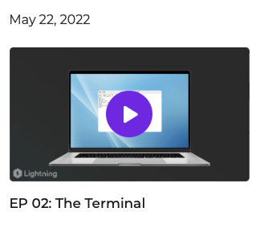
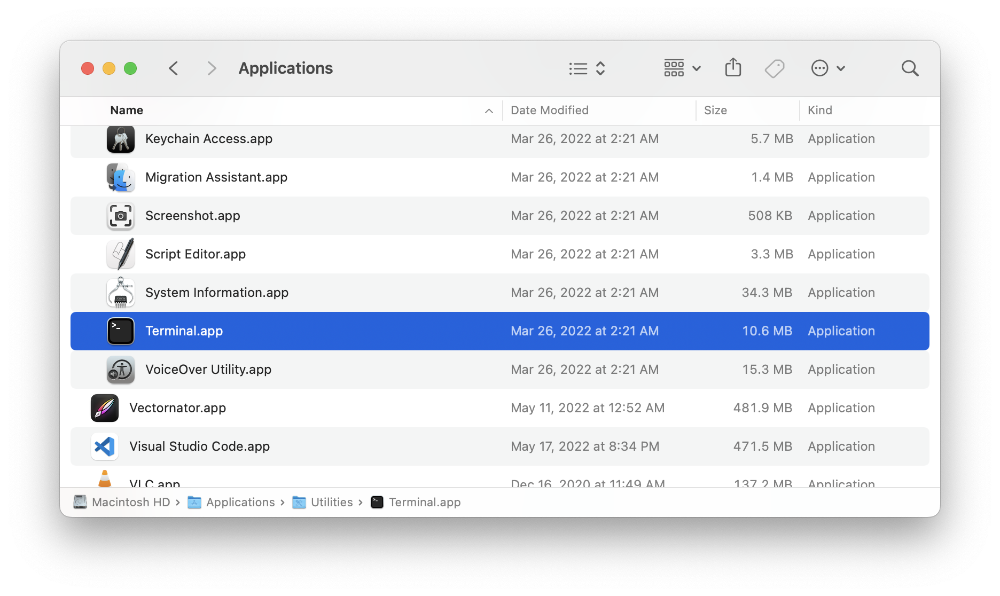
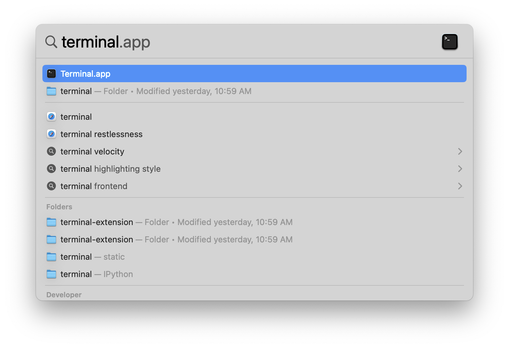

# Episode 2 Show Notes -- The Terminal

## Opening the Terminal

If you are on a Mac, you can find the terminal in the Applications/Utilities folder:

On a Mac, our favorite shortcut to open the Terminal.app is to press Command+Space and type terminal into the Spotlight search:

## Terminal Commands

Here is a summary of the terminal commands we covered in this episode:

- `ls`: shows the contents of the current directory
- `mkdir NewDirectory`: creates a new directory called `NewDirectory`
- `cd NewDirectory`: navigates into a directory called `NewDirectory`
- `open .`: opens the current directory in the macOS Finder app
- `clear`: clears the terminal
- `touch some_file.py`: creates a new, empty file called `some_file.py`
- `mv some_file.py main.py`: renames the `some_file.py` file to `main.py`
- `rm main.py`: removes (deletes) the file `main.py`
- `rm -r SomeDirectory`: removes a folder called `SomeDirectory`

## Links

- iTerm2: [https://iterm2.com](https://iterm2.com/)
- Wiliam's open source work: [https://github.com/williamFalcon](https://github.com/williamFalcon)
- Sebastian's open source work: [https://github.com/rasbt](https://github.com/rasbt)