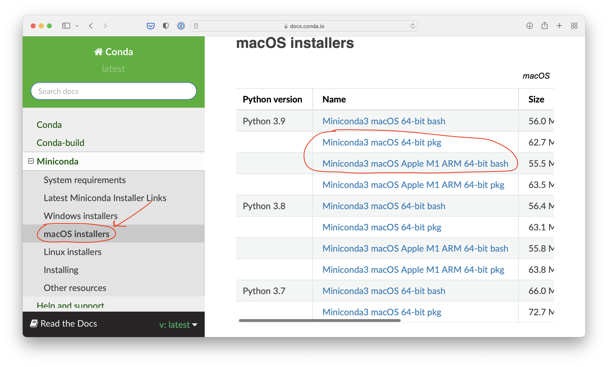
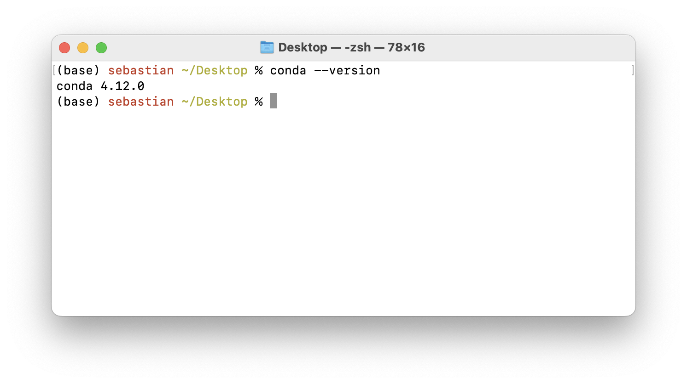
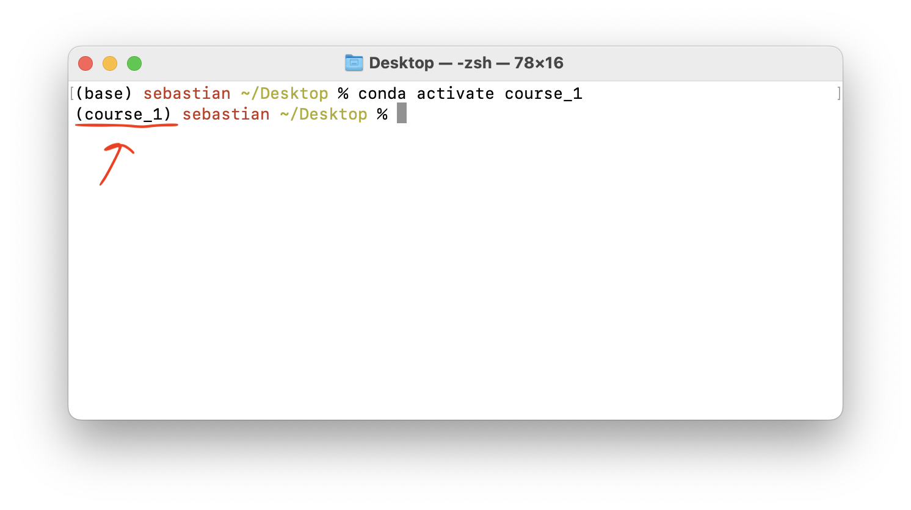

There are many ways we can set up a virtual environment: Virtualenv, Anaconda, miniconda, Mini-forge, and several others. 

Here, we are going to focus on miniconda and conda-forge.


## A note about Miniconda vs Mini-forge

You can think of Miniconda as a *mini* version of the Anaconda, which is a Python distribution that comes with many packages pre-installed. The main tool in Anaconda & Miniconda is the so-called `conda` environment and package manager. It is a tool for creating new virtual environments and installing packages. 

Now, Mini-forge is a community-maintained repository for conda-compatible packages. Using either miniconda or conda-forge is fine as the `conda` commands are identical. 

William happily uses Miniconda while Sebastian prefers mini-forge, but as mentioned above, both William and Sebastian use the exact same `conda` commands.


## Installing Miniconda


We recommend visiting the [official Miniconda website](https://docs.conda.io/en/latest/miniconda.html) to find the latest information on installing Miniconda for your machine and operating system. For example, as of this writing, Sebastian would select one of the two following options to install Miniconda on his MacBook, which has an ARM-based M1 chip:



Note that you can either choose the `pkg` or `bash` file installer. The `pkg` installer guides you through an interactive UI whereas the `bash` installer requires you to install Miniconda from your command line terminal. 

- If you download the `pkg` file, just double-click the downloaded file and follow the instructions.
- If you download the `bash file, go to your terminal, type 

```bash
bash Miniconda3-py39_4.12.0-MacOSX-arm64.sh
```

and follow the instructions that will be shown in the terminal. Note that the exact file name may differ based on which version of the bash installer you downloaded. Also, make sure you `cd`ed into the folder containing the installer file for this to work.


**Checking the installation**

After installing Miniconda, you can open a new terminal and check if it was successfully installed by running ` conda --version`. If it was correctly installed, you should see the current version number of conda, for example, as shown below:



## Useful conda & pip commands


1) **Check** what environments are currently installed on your computer:

```bash
conda env list
```


2. **Create** a new environment called `course_1`:

```bash
conda create --name course_1 python=3.7
```


3. **Activate** an environment:

```bash
conda activate course_1
```

Tip: the active environment is usually indicated at the beginning of the terminal prompt as shown in the screenshot below:




4. **List** all packages currently installed in the active environment:

```bash
pip freeze
```


To save the requirements list to a `requirements.txt` file, you can use the `>` symbol:

```bash
pip freeze > requirements.txt
```


5. **Install new** packages with pip

```bash
pip install pytorch-lightning
```

Alternatively, installing directly with conda would look like as follows:

```bash
conda install pytorch-lightning -c conda-forge
```


6. **Install** packages from a **`requirements.txt`** file:

   ```bash
   pip install -r requirements.txt
   ```

   

