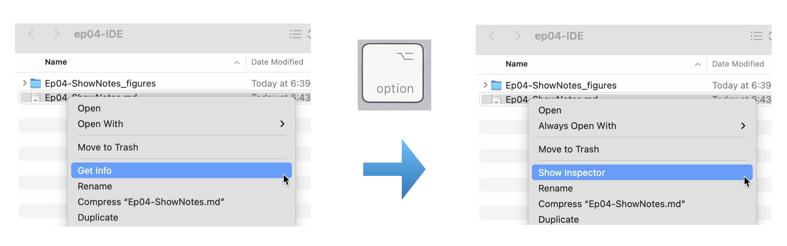
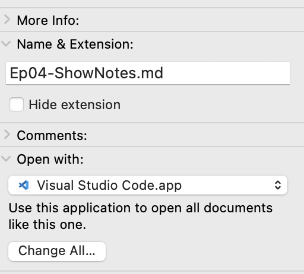
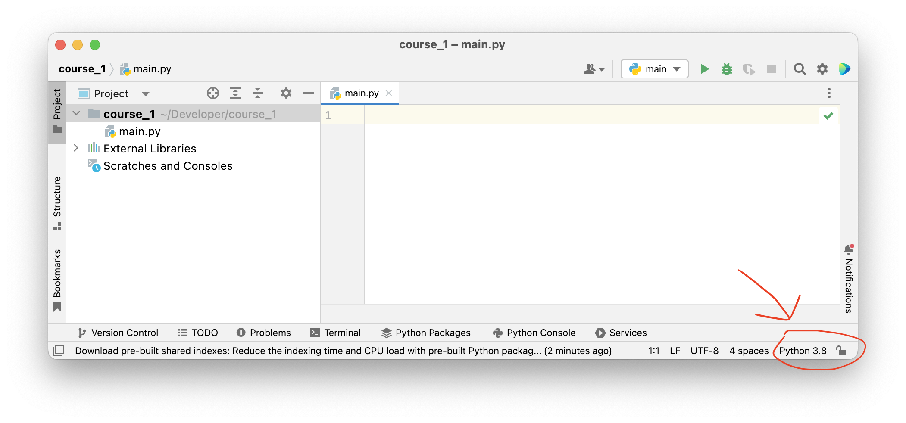

# Interactive/Integrated Developer Environments (IDEs)

It's 2022. There are lots of different tools available that make your life as a programmer, engineer, and researcher more convenient. This episode is focused on [PyCharm](https://www.jetbrains.com/pycharm/), which is one of the most widely used IDEs for Python. What is an IDE? IDE is short for integrated developer environment (sometimes also called "interactive" developer environment as Sebastian mentioned in the video). You can think of it as a text editor that is spring-loaded with lots of extra features that make you more productive. In that sense, it's both *interactive* and *integrated* ;).

---

(PS: While [William](https://twitter.com/_willfalcon) is showcasing some of the PyCharm essentials, [Sebastian](https://twitter.com/rasbt) is more of a [VSCode](https://code.visualstudio.com) user. However, while recording the episode and setting up a new computer, Sebastian realized that PyCharm is actually quite nice and convenient. VSCode is a more versatile code editor that can be customized for Python, PyCharm really comes with all batteries included when it comes to Python. VSCode can be very powerful as well, but it takes a lot of customization -- finding and installing the right plugins. With PyCharm, you get all the benefits out of the box. Consequently, Sebastian is currently toying with the idea of making PyCharm his primarily Python coding tool.)

---

## (Warm-up) New terminal commands

- `cat myfile` : prints the contents of a file named `myfile` to the terminal.
- `open myfile`: Open a file named `myfile`  in a preferred program.

Which program opens which file when running `open` depends on the file type and your setup. If you want to change the default program for a specific file type, you can do the following:

1) Navigate to the file (or a file with similar file type) in Finder, and right-click on it.
2) Hold down the option key and click on "Show Inspector"

3. Now, go to "Open with", select the program from the dropdown menu, and click on "Change All..."

## Installing PyCharm

Installing PyCharm is pretty straightfoward. Just go to the [official website](https://www.jetbrains.com/pycharm/) and follow the download link there. Also, we recommend starting with the community edition, which is free. If you like the community version and want some extra features, consider upgrading to the professional edition.

## Selecting a project interpreter

Once you opened an existing project, or created a new one, you can select your interpreter from the bottom right corner:

---

## Questions or Suggestions?

If you have questions or suggestions, please don't hesitate to reach out to William ([@_willfalcon](https://twitter.com/_willfalcon)) and Sebastian ([@rasbt](https://twitter.com/rasbt)) on Twitter or join our [Slack Channel](https://pytorch-lightning.slack.com/archives/C03GS6MTCCQ). For more episodes, also check out the [Lightning Bits: Engineering for Researchers](http://pytorchlightning.ai/edu/engineering-class).
