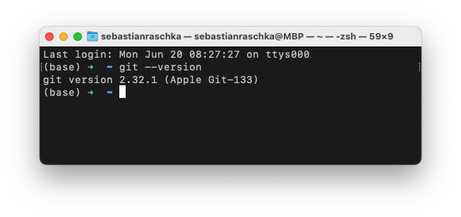
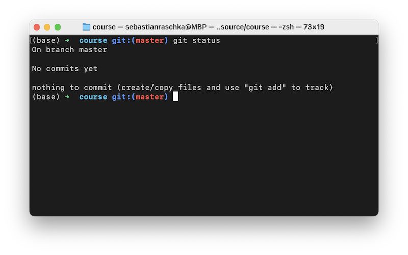
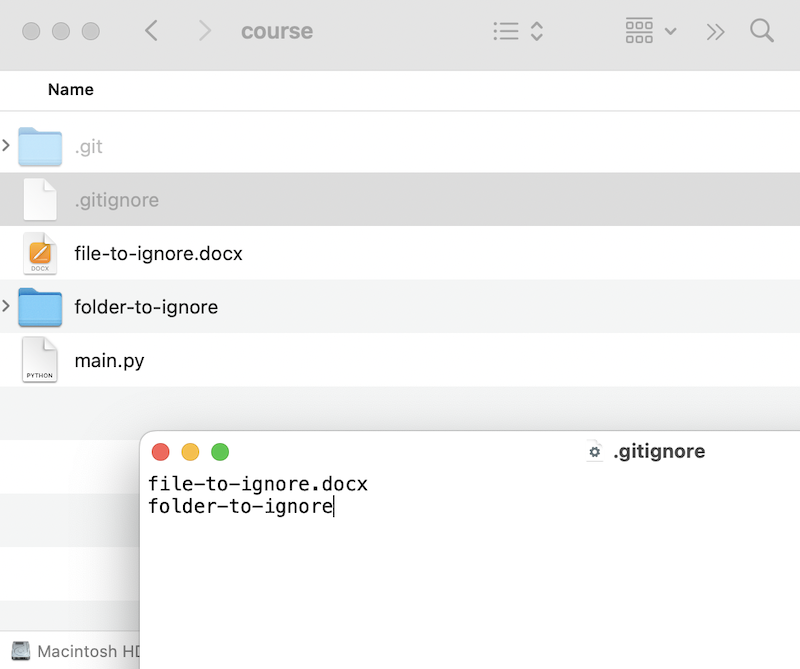
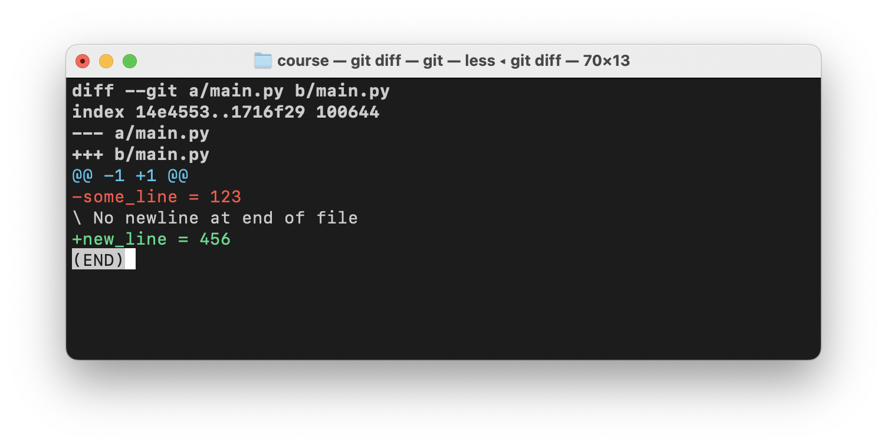

# Episode 6: Getting Started With Version Control Using Git

[Watch Episode 6]


## What is Git?

Version control (also known as source control) allows us to track code changes and work and collaborate on code projects effectively. In this episode, we learn the basics of Git, the version control software most people and companies use. 


You can check whether Git is already installed by executing `git --version` on the command line.



If it turns out that Git is not already installed on your computer, you can download the latest version from the [Git website](https://git-scm.com/downloads).


## Git and GitHub

You may have heard of GitHub before, and Git and GitHub are used almost synonymously these days. However, Git is actually the program we use for version control, and GitHub is a hosting platform. Most open-source projects use both. In this episode, we will focus on Git. The following episode will then focus on GitHub as a way to host our Git projects and how to code collaboratively.


## Essential Git Commands


**Renaming the Default Branch**


If this is your first time using Git, we recommend executing the following command to change the global settings:

```bash
git config --global init.defaultBranch main
```


This will rename the default branch to `main`, which is the common standard for most coding and open-source projects.

(Note that this is something you only need to do once.)


### 1) Creating and Checking Git Repositories


- `git init`: this will create a new Git repository in the current folder.
- `git status`: this will check the status of the current Git repository.




Note that `git init` will simply add an "invisible" `.git` folder to your current directory where it stores all git-related information. Other than that, it will leave your local folder and file structure unchanged. So, if you change your mind and want convert the folder back from a Git repository to a regular folder, just delete the `.git` folder.

If you see a `.DS_Store` (similar to in the screenshot above), this is a file created by macOS for Finder indexing and search properties. We can ignore it here.


**A Note About Invisible Files**

On macOS, all files and folders that start with a `.` (dot) are invisible in the Finder and the Terminal. 

If you want to see invisible files and folders in the Finder, you can press **Command+Shift+Dot**. If you to these these in the terminal, use `ls -a` instead of `ls` when you are listing the directory contents.


### 2) Committing Changes

Assume we made some changes to an existing file in the current Git repository. Now, we want to commit these changes. This is a 2-step process. First, we use `git add` and then we use `git commit`.

- `git add main.py`: Adds a file named `main.py` to the list of changes to be tracked for the `git commit` command.
- `git commit -m "my message"`: Commit the tracked changes to the Git history with a commit message "my message". 


### 3) Committing All Changes

Above, we saw how we could track and commit individual files. However, if you have a project with many files you want to track and commit -- this is true for most projects -- adding files one by one can become very cumbersome.

To track all changed files in a given directory, you can use the following modified `git add` command

- `git add .`: Track all changed files in a directory
- `git commit -m "my message"`: Commit tracked files (this is the same as before)

Now, often you want to track and commit most **but not all** files. For example, you typically want to ignore large files. You can create a `.gitignore` file and list the files to be excluded in that file.

For that to work, all we need is a .gitignore file in the same folder as the .git repository.





In the example above, we are ignoring the file "file-to-ignore.docx" and the folder "folder-to-ignore."


### 4) Checking Changes

- `git status`: This shows the changed and tracked files in the current Git repository
- `git log`: The log command shows the commit history.
- `git diff`: This command shows the lines that changed since the last commit. 


Lines that were removed start with a `-` sign, and lines that were added start with a `+` sign. In the example above, The `main.py` file was modified, where a line `some_line = 123` as removed and the line `new_line = 456` was added.




## Version Control in PyCharm & VSCode


Note that most IDEs also integrate Git into their UI. In this lecture, we used the Terminal to see how the basic Git commands work step by step. Many people still use Git from the command line while others prefer using Git within PyCharm or VSCode. Using the PyCharm or VSCode UI is totally up to you. However, for now we recommend using Git from the command line to familiarize yourself with the main commands. Later, we can revisit the UI interfaces.


## Further Resources

- We will cover Git in more detail in future episodes, and we recommend to stay tuned! However, if you are curious to explore more on your own, check out [this resource](https://git-scm.com) for a very detailed Git coverage.


**Prettier Terminal Layouts**

- For a pretty output formatting where the Git branches are shown in your terminal (similar to the screenshots above), check out the [Oh My Zsh](https://github.com/ohmyzsh/ohmyzsh) project.
- If you are coding on a Mac and also want to style your macOS terminal in general, also have a look at the different macOS terminal themes [here](https://github.com/lysyi3m/macos-terminal-themes). (Sebastian is using the "VS Code Dark Plus" theme for the screenshots above.)


## Questions or Suggestions?

If you have questions or suggestions, please don't hesitate to reach out to William ([@_willfalcon](https://twitter.com/_willfalcon)) and Sebastian ([@rasbt](https://twitter.com/rasbt)) on Twitter or join our [Slack Channel](https://pytorch-lightning.slack.com/archives/C03GS6MTCCQ). For more episodes, also check out the [Lightning Bits: Engineering for Researchers](http://pytorchlightning.ai/edu/engineering-class).

