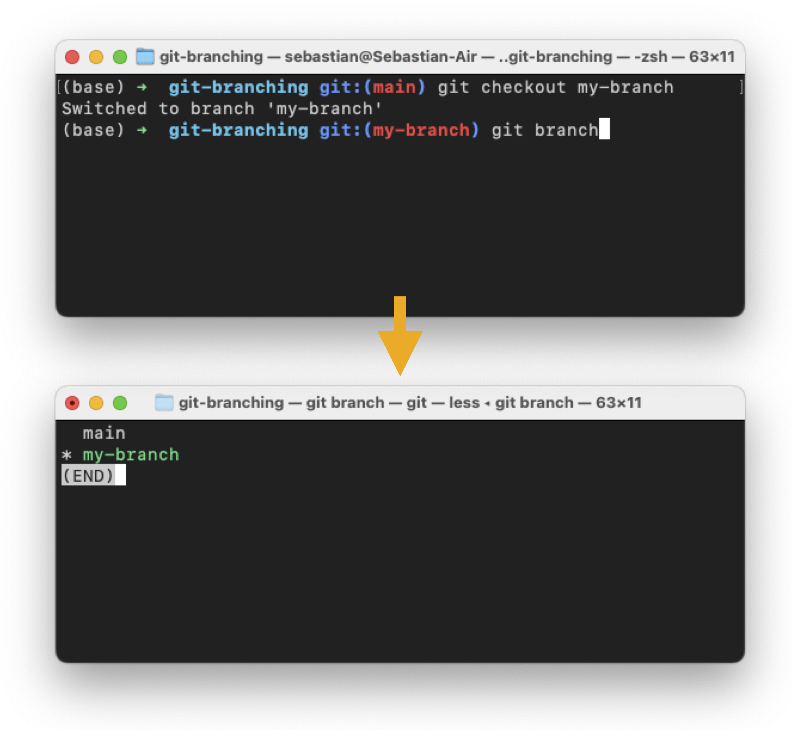

# Episode 7: Managing Code Projects with Git Branching

[Watch Episode 7](https://youtu.be/tzJDZY1x31I)


## Recap

In the previous episode, we covered the basic concepts and commands behind Git for version control. If you haven't watched the [previous episode](../ep06-git-basics/Ep06-ShowNotes.md), we recommend checking it out before continuing reading. 


## Git Branching -- Why?

In the more traditional workflow, we would create copy of a file before we make a modification -- here, this could be a code file or a text document we are working. The copy is there to ensure we have the original copy in case we don't like our changes. However, keeping multiple copies around is very tedious (and also ineffecient). Git branching is a way we can create and manage changes more elegantly.

By making a new branch in Git, we implicitely make a copy of the Git repository and can make modifications without altering the original. We can have multiple branches at the same time, and the branching mechanism allows us to merge back the changes into the main branch in case we want to adopt them permanently.

This is also very useful in code collaboration. "Useful" is maybe not the right word: it's pretty much "essential." We will learn more about collaborating on Git projects in the next episode.


## Essential Git Branching Commands


- `git branch`: Shows a list of the existing branches in the current Git repository

- `git branch my-branch`: Create a new branch called `my-branch`
- `git checkout my-branch`: Change your current "position" from the current branch to `my-branch`


---

**Side note: Renaming the Default Branch**

For new repositories, you can change the name of the default branch from `master` to `main` using the following command:

```bash
git config --global init.defaultBranch main
```


---




**Pro Tip**:

Use 

```bash
git checkout -b my-new-branch
```

To combine the two steps `git branch my-new-branch` and `git checkout my-new-branch`.

Or, if you like if you prefer your shortcuts to be even more concise, you can use `gcb my-new-branch` to achieve the same thing!


## Merging Branches

At some point, if we like the changes we made in the current branch, we may want to merge back these changes into the main branch

1. `git checkout main`: Switch back to the main branch
2. `git merge my-branch`: Merge the branch `my-branch` into the currently active branch (here: `main`) 
3. `git branch -D my-branch`: Optionally delete the branch to clean up your Git repo. 


---

**Side note: Rebasing**

Some people prefer a workflow based on `git rebase`. Usually, this means applying the changes on top of a current branch. Or more concretely, you may be asked to rebase your current commits in the feature branch (`my-branch`) on top of the main branch. 

If you want to learn how rebasing works, we recommend [this excellent tutorial](https://www.atlassian.com/git/tutorials/rewriting-history/git-rebase).

---


## Questions or Suggestions?

If you have questions or suggestions, please don't hesitate to reach out to William ([@_willfalcon](https://twitter.com/_willfalcon)) and Sebastian ([@rasbt](https://twitter.com/rasbt)) on Twitter or join our [Slack Channel](https://pytorch-lightning.slack.com/archives/C03GS6MTCCQ). For more episodes, also check out the [Lightning Bits: Engineering for Researchers](http://pytorchlightning.ai/edu/engineering-class).

