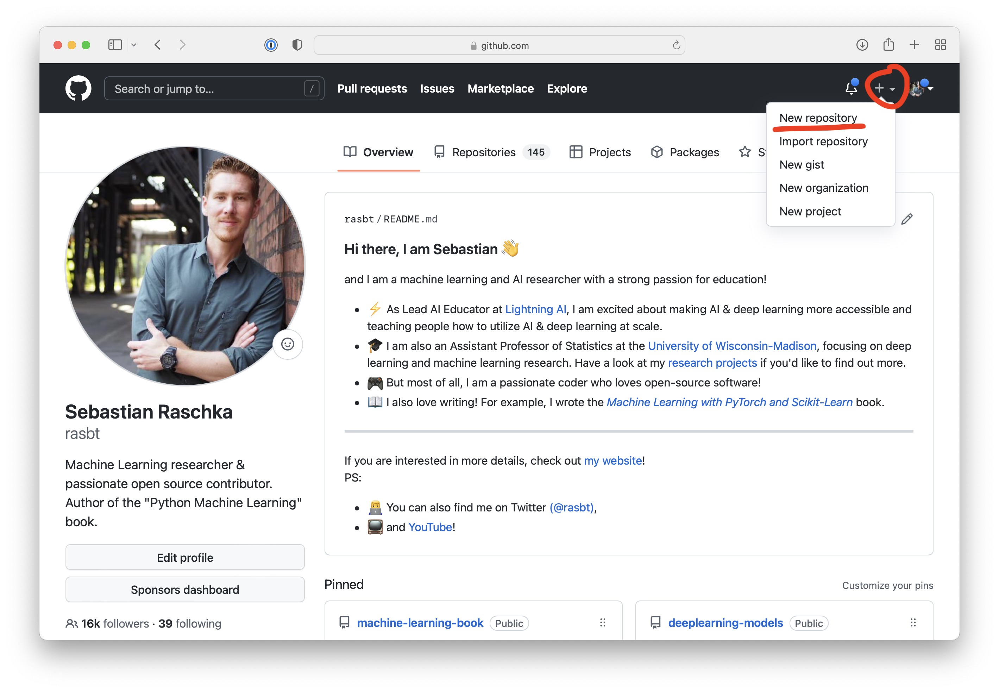
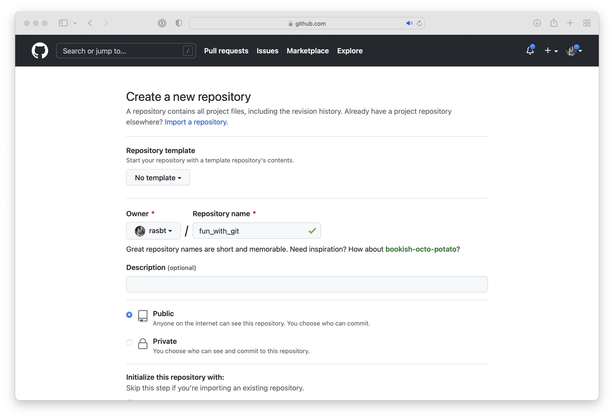
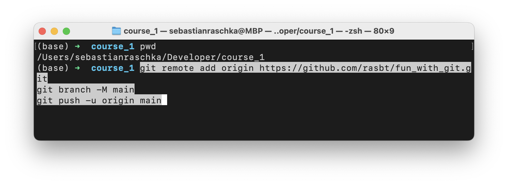

# Episide 8: Creating a Pull Request on GitHub

[Watch Episode 8](https://youtu.be/_0X_dljzr5E)


## Recap

In the previous episodes, we covered the basic concepts and commands behind Git for version control. These episodes are not mandatory for creating projects on GitHub, but we recommend you check them out as well:

- [Ep 06: Version Control for Code Using Git](https://youtu.be/mndB6zHmU3k)
- [Ep 07: Managing Code Projects with Git Branching](https://youtu.be/tzJDZY1x31I)


## Hosting your Git Projects on GitHub

As we have seen in previous episodes, Git is a program that helps you with managing your code. [GitHub](https://github.com), as the name implies, is a "hub" for hosting your projects (maintained via Git version control) on the web. You can think of GitHub as a webserver and a user interface for sharing your code projects. 

Note that using GitHub is entirely free, however, there is a paid tier with additional features such as private repositories if needed.

There are also other related services such as BitBucket and GitLab. However, GitHub is by far the most popular choice among developers. We highly recommend using GitHub because most of the open source community is using it, and thus it makes it easier to collaborate with others.


## Creating GitHub Projects

First, if you haven't done so, yet, you can sign up to GitHub and create an account here: [https://github.com](https://github.com) (note that this is entirely free).

By the way, if you are interested, you can check out William's and Sebastian's GitHub repositories here:
- Sebastian: [https://github.com/rasbt](https://github.com/rasbt)
- William: [https://github.com/williamfalcon](https://github.com/williamfalcon)


Once you have a GitHub profile, you can create a new repository from the upper right corner:

 




## Linking  A Local Project To GitHub


If you followed the steps above and created a new GitHub repository, copy the following three lines from the UI:


```bash
git remote add origin https://github.com/rasbt/fun_with_git.git
git branch -M main
git push -u origin main
```

For now, keep these lines handy, and then head to your local Git (not GitHub) repository on your computer:

(The `pwd` command prints the current directory.)

Then, just paste the 3 lines we copied earlier into the terminal and press Enter:



Then, when you refresh your browser page, you should see your Git project now synced with your GitHub project:


## Collaborating on GitHub

Note that there are two different ways we can collaborate on a code project.

1) we fork a repository. This means that we create a copy of someone else's repository under our own account. Then, we clone this forked repository to our computer and make changes locally. After making the changes locally, we push the the changes back to the repository on our GitHub repository. And, if we are finished, we submit a pull request.

2) We are added as a collaborator to someone's GitHub repository. In this case, we don't need fork the project and can clone the GitHub repository directly. This is what we are assuming below.

You can add a collaborator as follows, via the Settings menu:


Assuming you are a collaborator, you can clone the repository and make changes to the repository:


Copy the GitHub repository URL as shown above and use `git clone` on your terminal:


The most common workflow is to create new features in a new branch. We recommend not making changes directly to the main branch.


Now, we can make changes to files in this repository. After we are satisfied with the changes, we can use our familiar git commands to stage and commit the changes

```bash
git add .
git commit -m 'i added a new feature!'
```

While this is all we need when we use git locally, the question is now how do we sync this back to the server? This is where a new git command comes in! `git push origin` !


Finally, after pushing the new changes to the new feature branch, we can create a new Pull Request via the GitHub interface:


You can think if a pull request as a suggestion to merge the new feature branch into the project's main branch. 


In the next episode, we will learn how to interact with collaborators via the GitHub interface upon submitting a Pull Request.

---


## Questions or Suggestions?

If you have questions or suggestions, please don't hesitate to reach out to William ([@_willfalcon](https://twitter.com/_willfalcon)) and Sebastian ([@rasbt](https://twitter.com/rasbt)) on Twitter or join our [Slack Channel](https://pytorch-lightning.slack.com/archives/C03GS6MTCCQ). For more episodes, also check out the [Lightning Bits: Engineering for Researchers](http://pytorchlightning.ai/edu/engineering-class).

