# Episide 8: Creating a Pull Request on GitHub

[[Watch Episode 9]()]


## Recap

In the previous episode ([Ep 08](../ep08-github-pr/Ep08-ShowNotes)), we learned how to create a pull request and ended on a cliffhanger.


## Using The GitHub Interface


Once a Pull Request has been opened, the easiest way to collaborate on the Pull Request is by using the GitHub interface in the web browser.


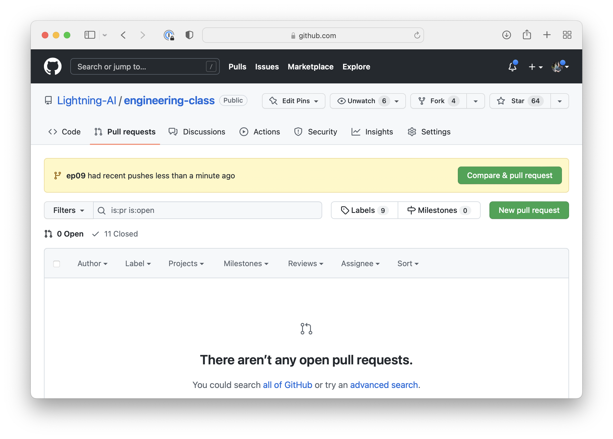

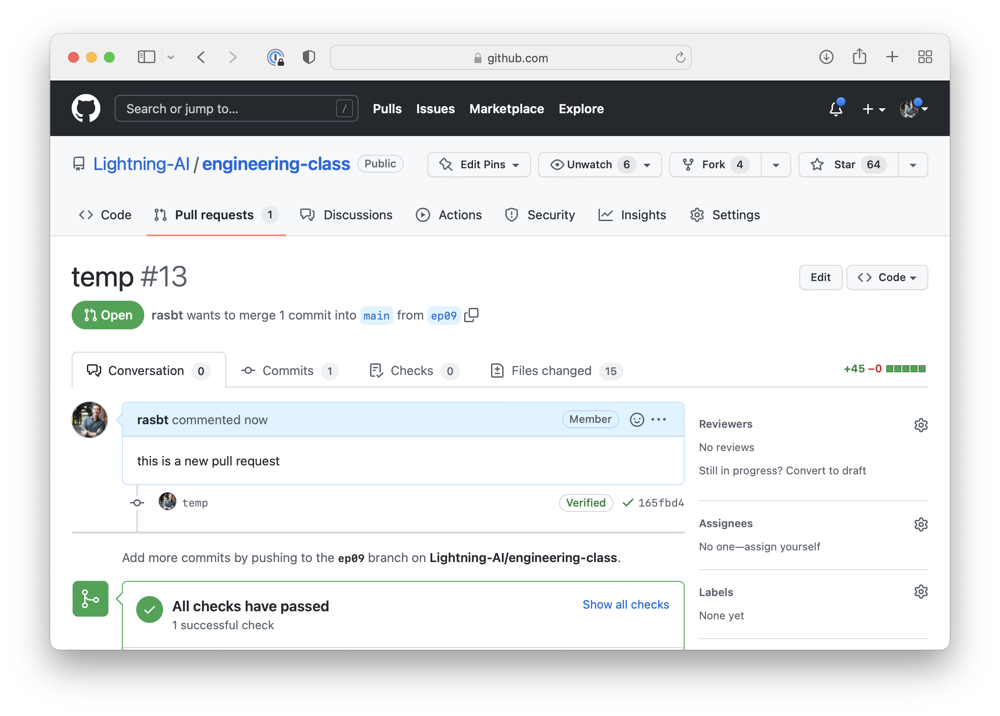


The GitHub user interface in the browser provides a rich interface for commenting and checking file changes:


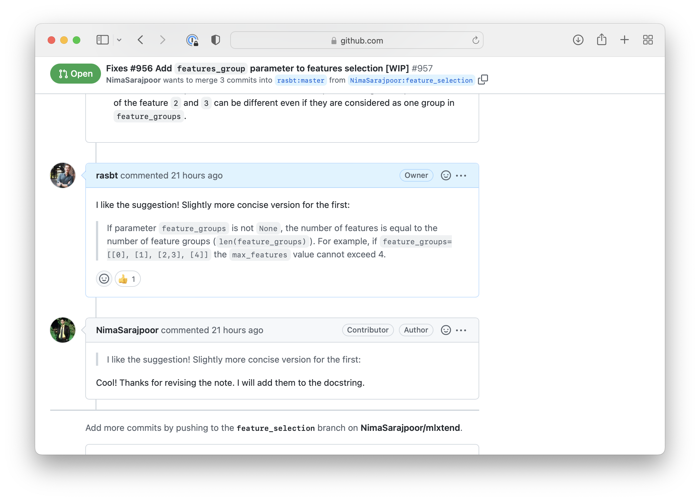

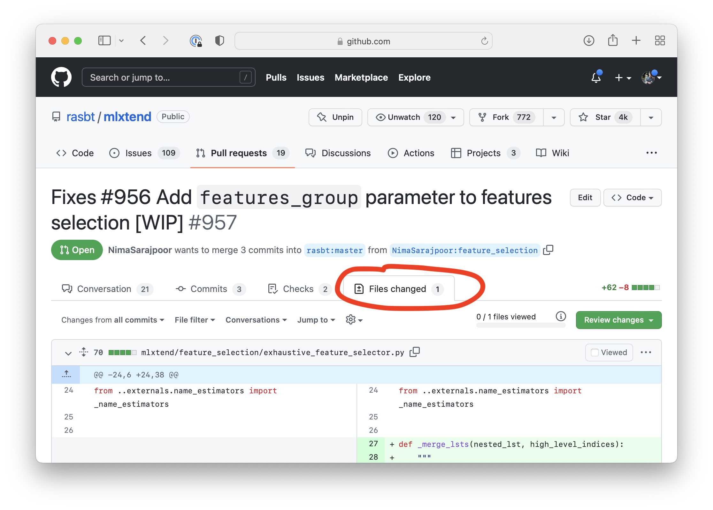


## Creating A Pull Request For An Open Source Project

Suppose you want to make a change to William's `fun_with_git` project. 

The first step is to fork the project to your own account:

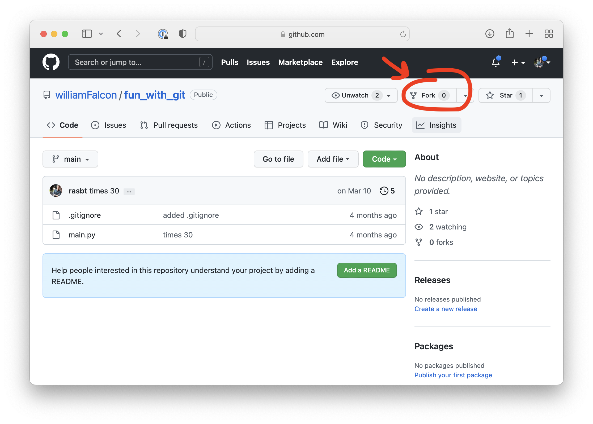

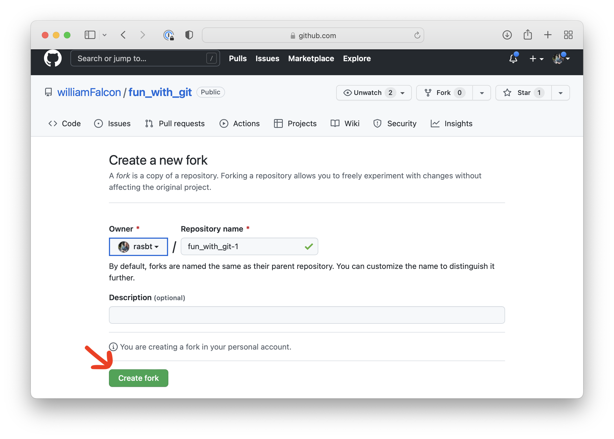

Now, the project should be available as a fork under your own account:

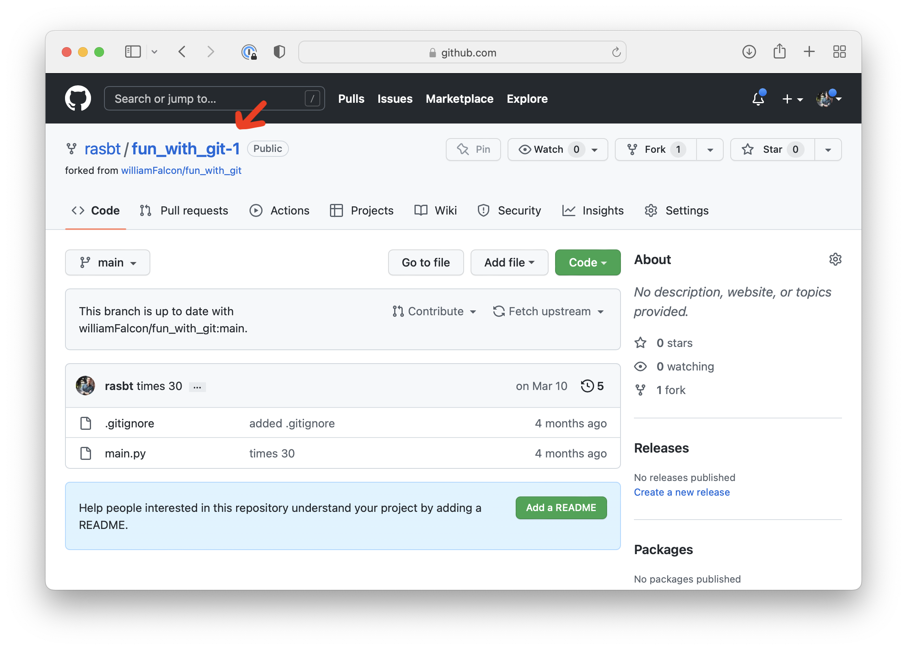

Next, to make the proposed changes, I first clone the forked repository to my computer. Use the following `git clone` command in your terminal:

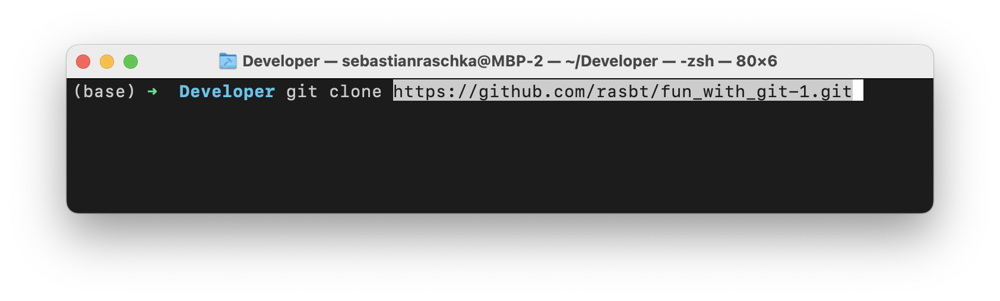

You can get the exact name via the GitHub interface:

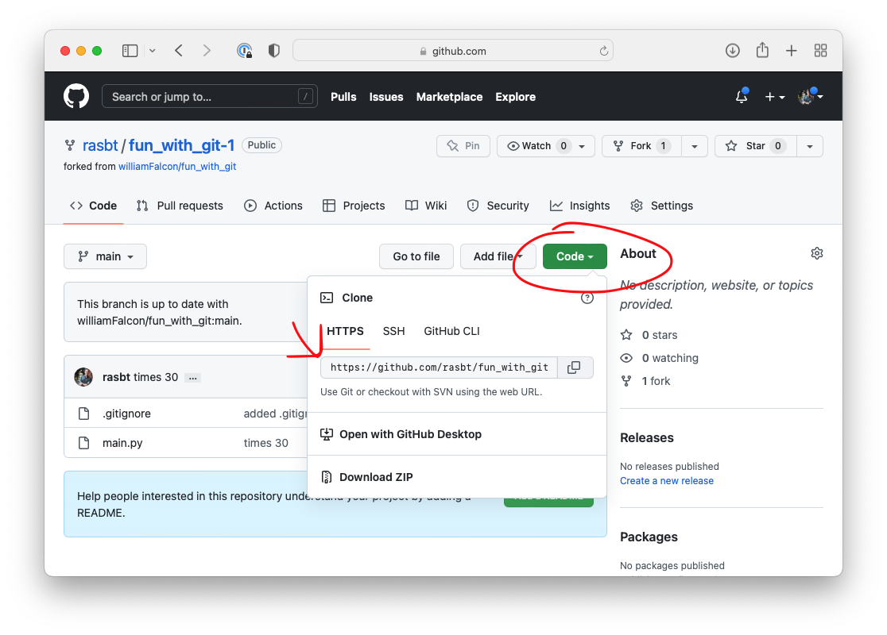


Now, I checkout a new branch for making the proposed changes:

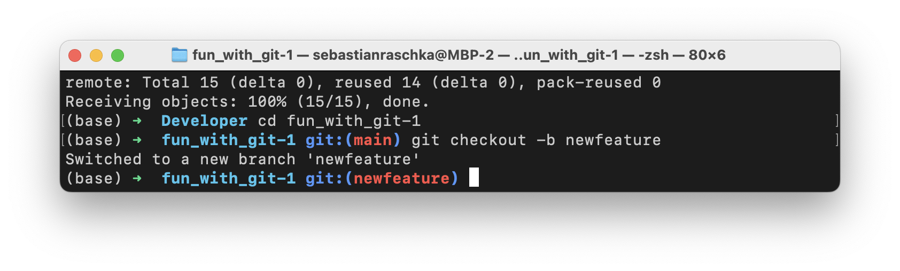

Suppose you made a few changes to the file and pushed these to GitHub:

```bash
git add .
git commit -m "changes"
git push origin newfeature
```


Now, you can create a Pull Request on the projects **original** repository -- that is, William's repository. (You don't have to modify your fork at this point.)

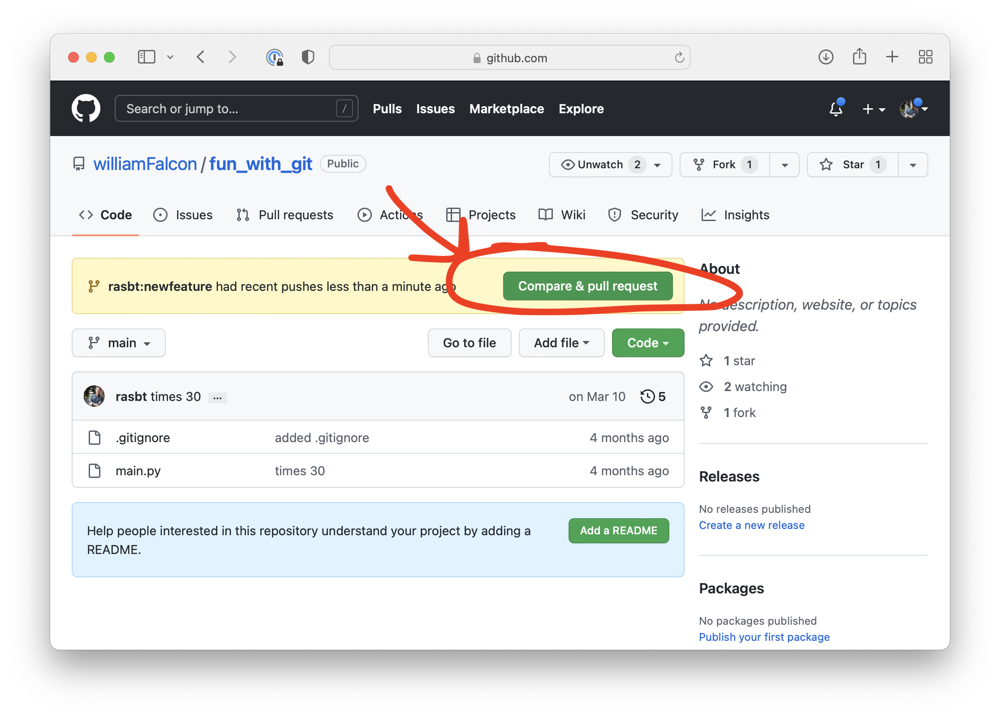

After opening the Pull Request, suppose the maintainer asks you to make changes. All you need to do is to make the changes locally on your computer, on the existing branch of your fork. Similar to as before, just stage, commit, and push the changes:

```bash
git add .
git commit -m "more changes"
git push origin newfeature
```

This will automatically update the Pull Request.

Usually, this update cycle repeats until the maintainer is happy with the changes and merges your Pull Request.

## Syncing Forks With Upstream

If  you forked a repository a while ago and want to make a new Pull Request, your fork might be out of data. Before creating a new branch, making changes, and opening a new pull request, it is usually a good idea to sync your fork with the original project. 

More concretely,  suppose some time has passed since our first Pull Request to William's `fun_with_git` repository. Now, we want to make a second Pull Request, but before we do so, we want to update our fork with William's latest changes in his original repository.

We can sync our fork with the **original** repository as follows.


### 1) Configuring A Remote Branch

First, let's configure a remote that points to the upstream (**original**) repository on GitHub. We start by list the current configured remote repository of your fork by executing

```
git remote -v
```

You should see something like the following where your fork shows up:

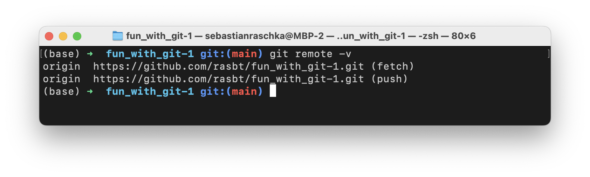

We now need to specify a new remote *upstream* repository which points to William's repository:


```bash
git remote add upstream https://github.com/williamFalcon/fun_with_git
```

To verify that this worked successfully, let's use `git remote -v` again:

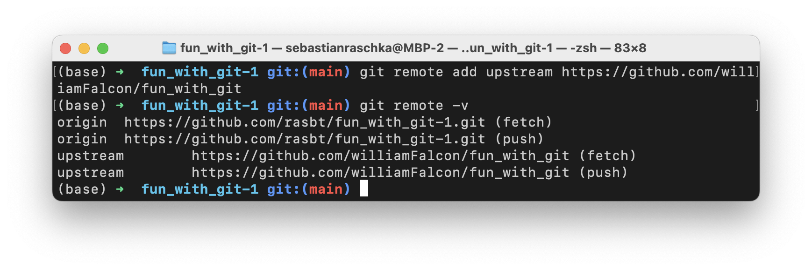

### 2) Syncing Our Fork

Now that we have configured William's repository as the `upstream` repository, we can fetch changes from it:


```bash
git fetch upstream
```


Then, we checkout the main branch:

```bash
git checkout main
```


And, finally, we merge the changes in `upstream/main` to your local main branch by executing


```bash
git merge upstream/main
```

After this procedure, your forked repository should be up to date compared to the **original** repository, and you should be good to go in terms of making a new Pull Request.


## Making Changes To A Pull Request As Contributor


If  you are a maintainer of a GitHub repository and someone opened a Pull Request, you will likely be the one asking for changes. Sometimes, it might actually be useful and more productive to make the changes directly yourself instead of asking for them. You can do this as follows:

First, clone the repository of the person's fork (the person who is submitting the Pull Request). You can find the address if you scroll to the bottom of the Pull Request and click on "command line instructions:"

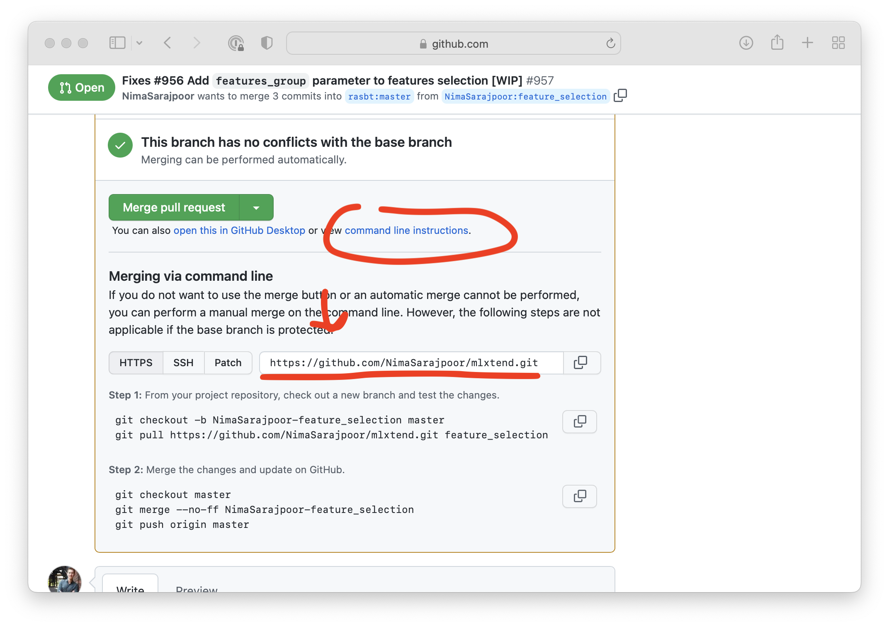

Then, in the terminal, check out the contributor's branch. This is the branch listed on the top of the Pull Request:

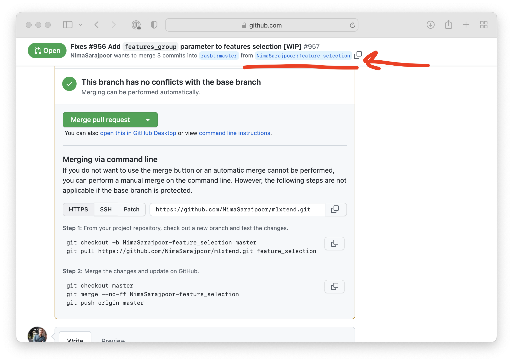

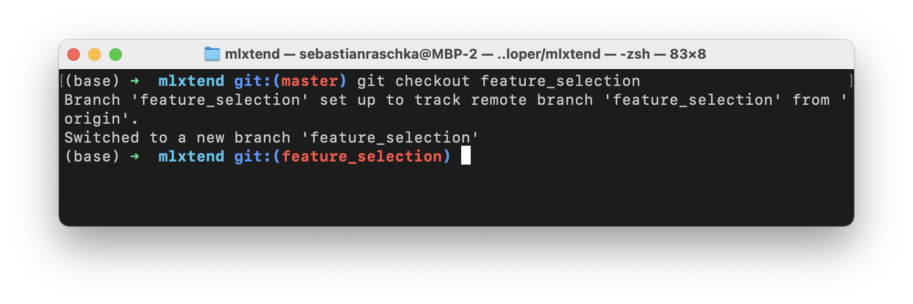

You can now make changes to any file and submit them back to the Pull Request using the usual git workflow:


```bash
git add .
git commit -m "made some changes to the pull request"
git push origin feature_selection
```


Finally, it would be nice to let the contributor that you made changes:

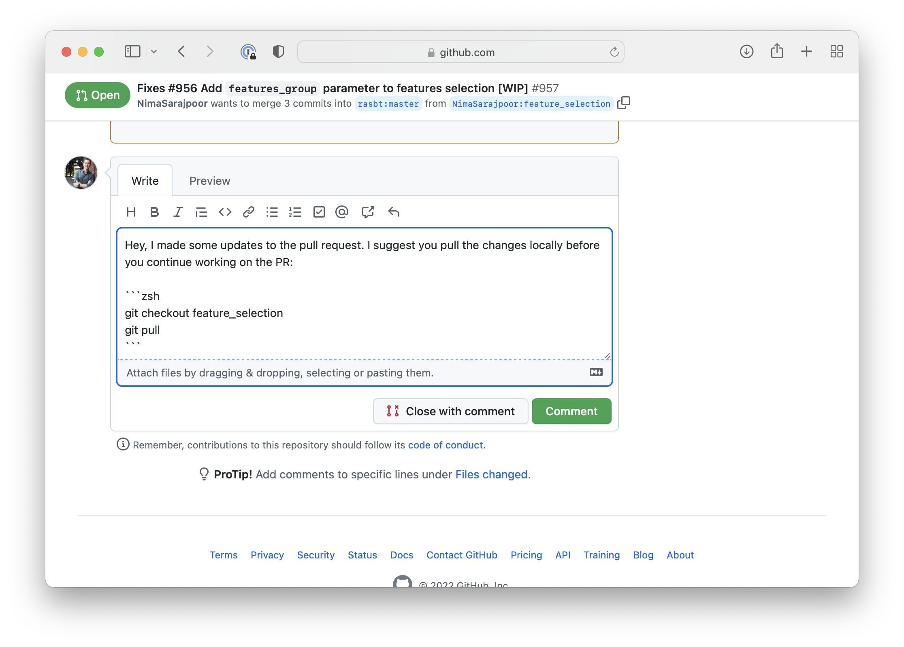


---


## Questions Or Suggestions?

If you have questions or suggestions, please don't hesitate to reach out to William ([@_willfalcon](https://twitter.com/_willfalcon)) and Sebastian ([@rasbt](https://twitter.com/rasbt)) on Twitter or join our [Slack Channel](https://pytorch-lightning.slack.com/archives/C03GS6MTCCQ). For more episodes, also check out the [Lightning Bits: Engineering for Researchers](http://pytorchlightning.ai/edu/engineering-class).

